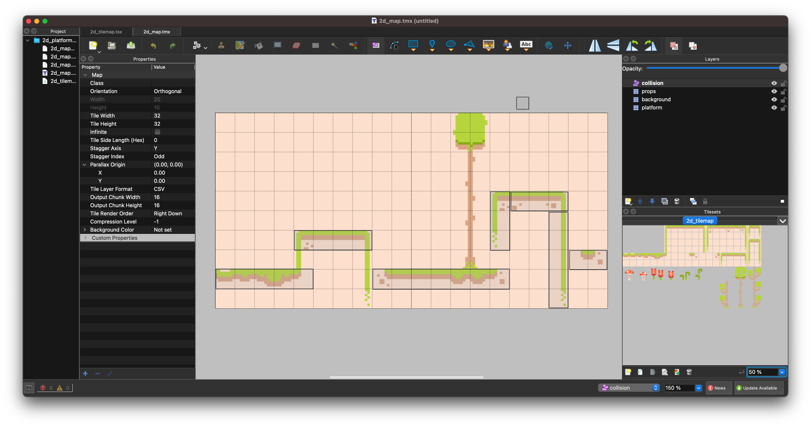
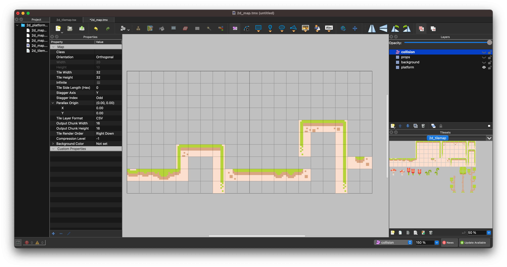
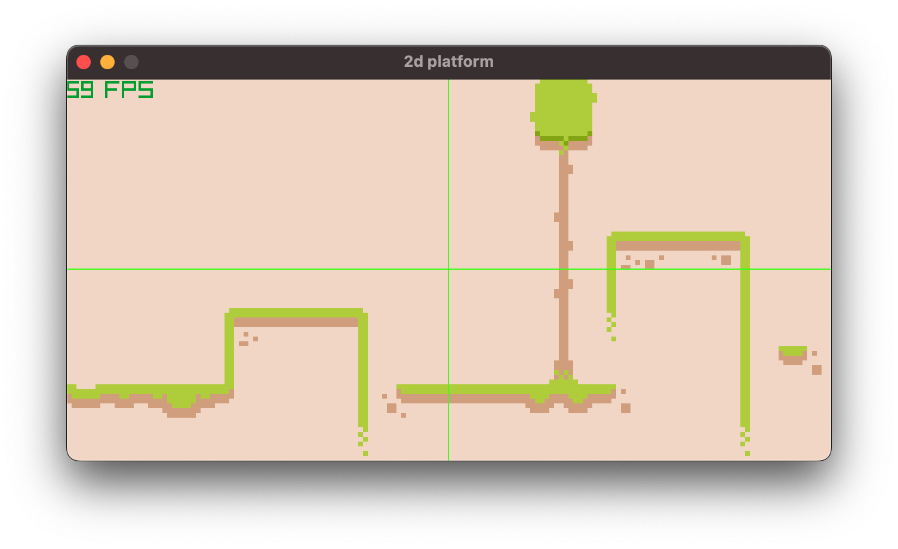
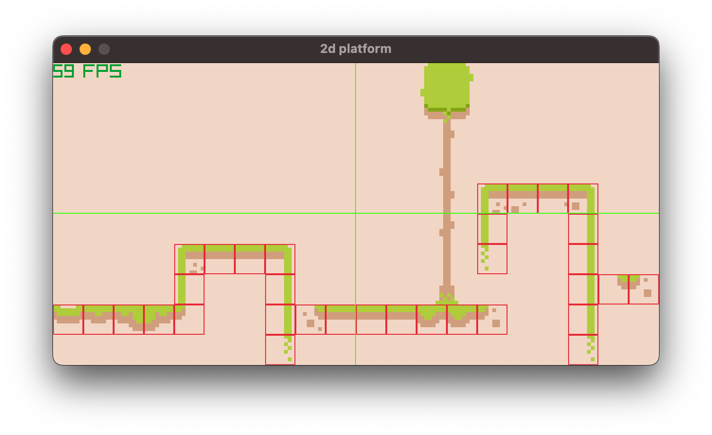

## 2d platformer
- decoding map data from [Tiled](https://www.mapeditor.org/)

### Tiled editor
Current map in Tiled is:
- `640 x 320`
- Tile Width: `32px`
- `20 x 10` grid
- `3` textures layers:
    - platform
    - props
    - background: I added this one in `v2` because my original solution to have raylib background the same color or the tile didn't work
        - looks like `COLOR :: rl.Color{252, 223, 205, 255}` is not the right RBG so rather trying to find, I just added another layer
- `1` collision layer: the elements in this layer do not have the same `width`, `height` as the texture layers (i.e. tile width) but rather encapsulates several tiles

- Tiled app when masking one or several layers in the editor

## After decoding

### Adding the collision layer debug

- the collision layer has been created using an empty tile from the timemap, i.e there's no texture
- only useful information is the LOCATION of the tile

