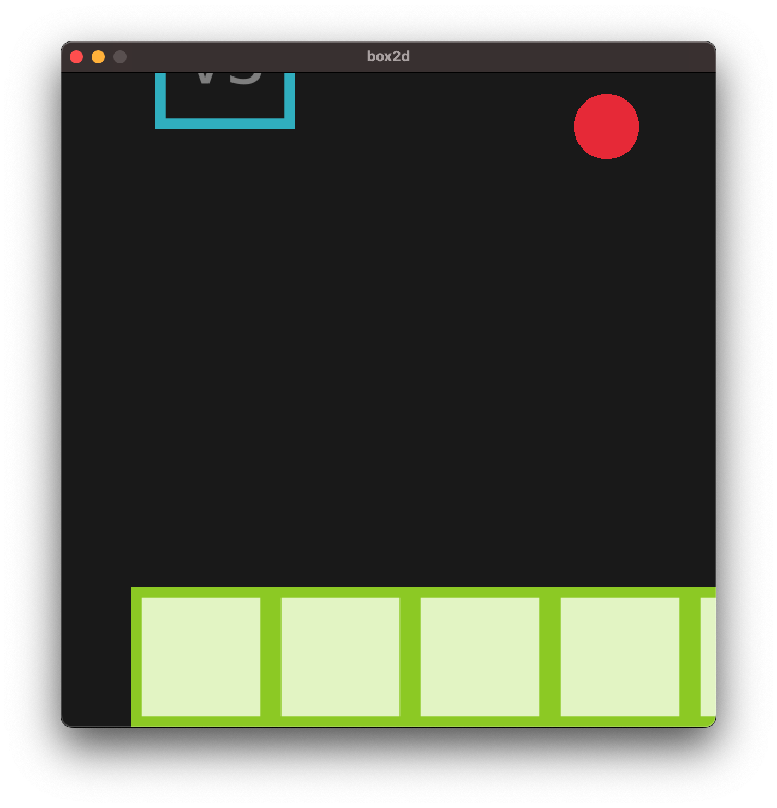
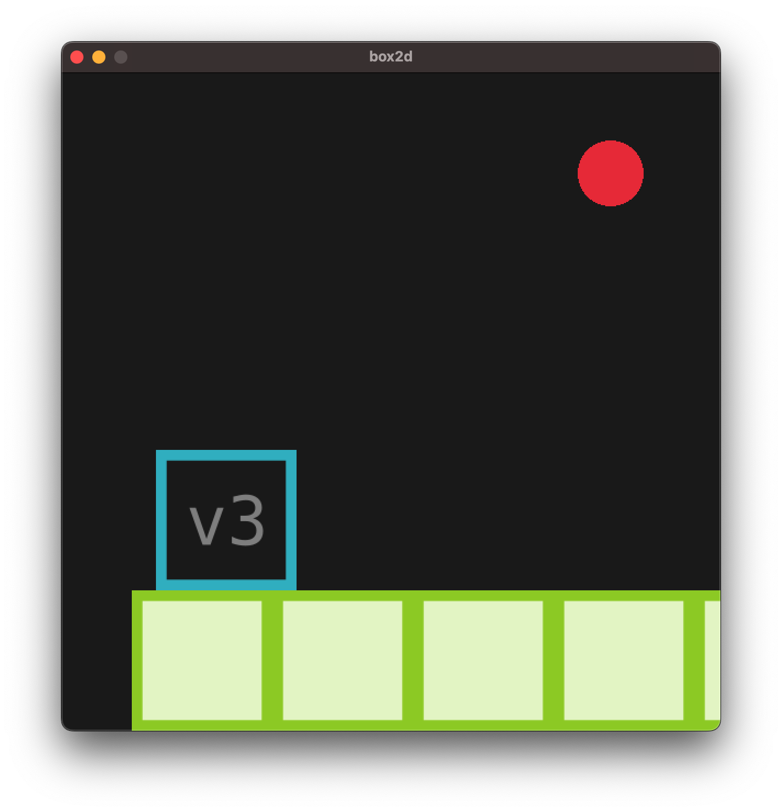
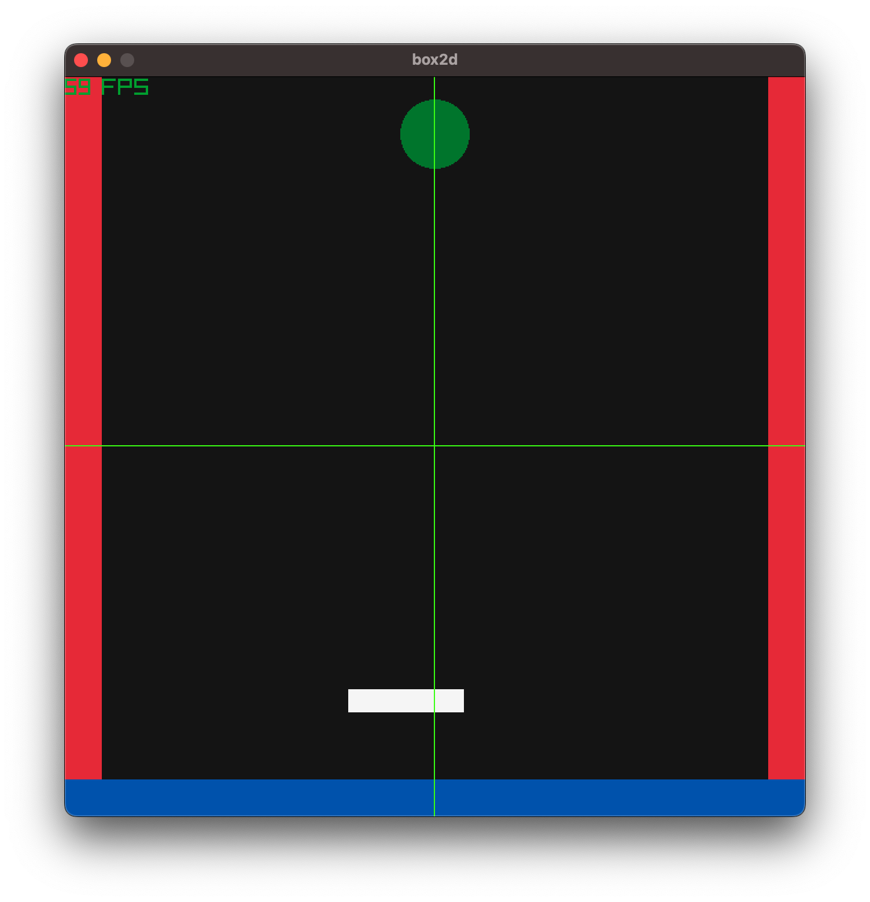

- this is a test to use [box2d](https://box2d.org/documentation/index.html) as physics engine with `Raylib`
- following the script : https://github.com/erincatto/box2d-raylib/blob/main/main.c

---
## 2026-09-03
- so far I got a floor


- update:





## 2026-09-05

- compile a given file
```odin
odin build main2.odin -file -debug -json-errors -show-more-timings -vet
```

- run a given file
```odin
odin run main2.odin -file
```

- current version: `main2.odin`
- diffs:
    - the creation of the `world`, as well as `body`, `shape` have been improved and refactored
    - added a paddle as a `kinematic` body
- scene has:
    - `floor`, `left` and `right wall` as `static bodies`: Immovable environment geometry, such as floors, walls, platforms, and terrain. They have infinite mass and do not move in response to forces or collisions.
    - `ball` as a `dynamic body`: Fully simulated bodies. Box2D updates their position and velocity based on gravity, forces, impulses, joints, and collisions.
    - `paddle` as a `kinematic body`: Motion controlled by your code, usually by setting their velocity. They are not affected by gravity, forces, or collisions in the same way dynamic bodies are. Other bodies can collide with them.



