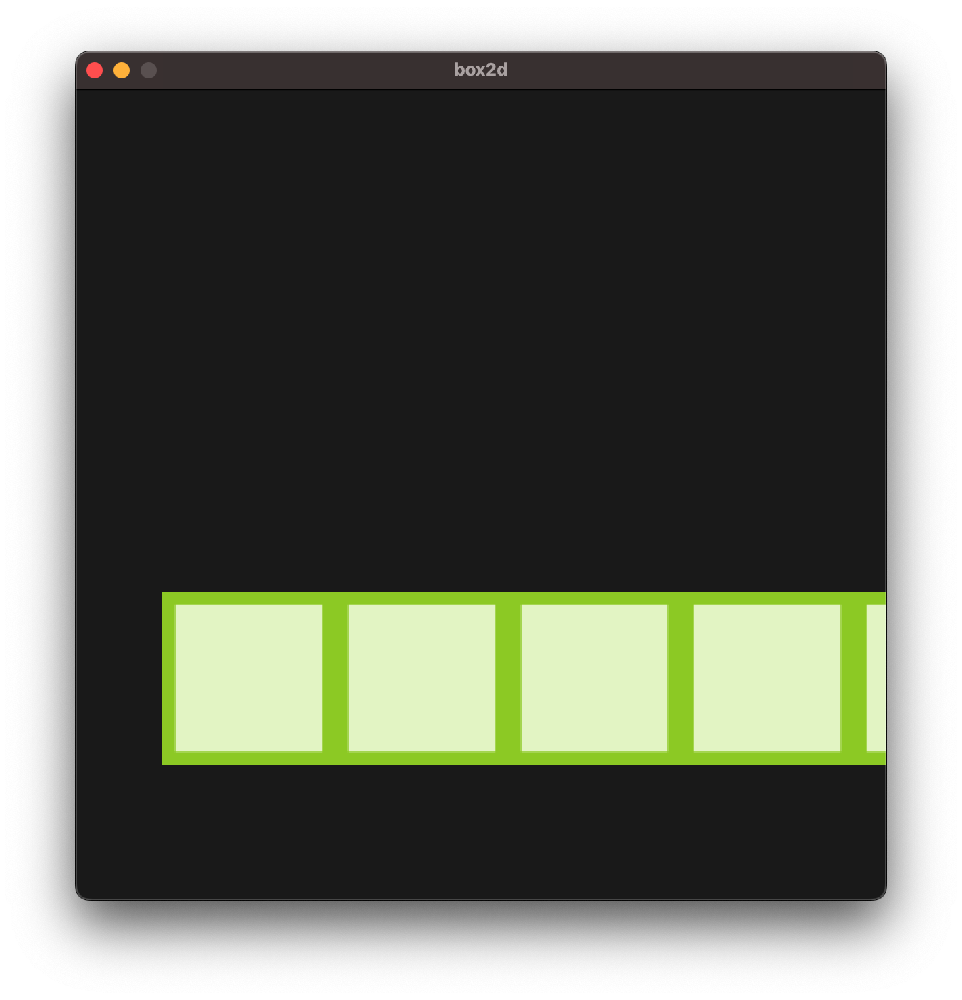

- this is a test to use [box2d](https://box2d.org/documentation/index.html) as physics engine with `Raylib`
- following the script : https://github.com/erincatto/box2d-raylib/blob/main/main.c

---
## 2026-09-03
- so far I got a floor

